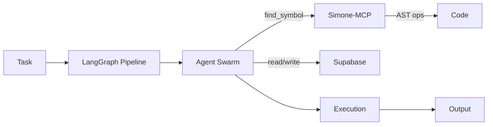

# Code-Swarm Documentation

Welcome to **Code-Swarm**, a multi-agent AI system for software engineering powered by LangGraph and Simone-MCP.

## What is Code-Swarm?

Code-Swarm is a **swarm of AI agents** that work together to:
- Analyze project requirements
- Design system architecture
- Generate and validate code
- Run tests and iterate on solutions

### Key Components

| Component | Purpose |
|---|---|
| **Agents** | Specialized AI personas (Zeus, Atlas, Iris, etc.) |
| **LangGraph** | Orchestration framework for multi-agent flows |
| **Simone-MCP** | AST-level code manipulation (symbol-safe edits) |
| **Supabase** | PostgreSQL database + Auth + Realtime |
| **Vercel** | Serverless deployment platform |

## Quick Start

```bash
# 1. Install
pip install code-swarm

# 2. Configure
cp .env.example .env
# Edit .env with your SUPABASE_URL, SIMONE_MCP_URL, etc.

# 3. Start API server
code-swarm api --host 0.0.0.0 --port 8000

# 4. Create your first agent
curl -X POST http://localhost:8000/agents \
  -H "Content-Type: application/json" \
  -d '{
    "name": "my-agent",
    "model": "gpt-4",
    "role": "backend",
    "capabilities": ["code-generation", "testing"]
  }'
```

## Architecture Overview



## Documentation Sections

- **[Getting Started](getting-started.md)** — Installation, configuration, first run
- **[Architecture](architecture/overview.md)** — System design and agent personas
- **[API Reference](api/rest.md)** — REST, gRPC, and WebSocket endpoints
- **[Deployment](guides/deployment-vercel.md)** — Deploy to Vercel
- **[CLI Guide](guides/cli.md)** — Command reference

## Status

**Version:** v0.4.0 Beta  
**Implemented:** Core API, Authentication, Database, Rate Limiting, WebSockets, CLI  
**In Progress:** RLHF feedback loops, Hybrid Memory, Kubernetes, Frontend

Last updated: 2026-05-03
